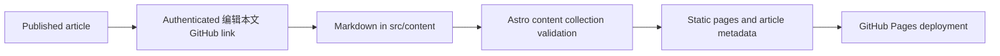

# Motion-inspired personal blog redesign

**Status:** proposed for review  
**Date:** 2026-08-01  
**Scope:** visual and interaction redesign of `liuhaojie02.github.io`, while preserving Astro's static GitHub Pages deployment and Markdown content workflow.

## Decision summary

The site will become a quiet, image-led reading experience: a cinematic but restrained home-page hero, a compact floating navigation bar, and a high-contrast editorial reading surface. It takes the useful design principles from [RRTiamo/spring_blogs](https://github.com/RRTiamo/spring_blogs)—a full-bleed opening image, a translucent navigation surface, and content cards with clear hierarchy—without copying its page structure or turning the blog into a dashboard.

The user has confirmed permission to reuse that project's image assets. The primary visual asset will be its `public/bg-image.png` for the home hero. The file will be copied into this repository under a descriptive, format-correct filename and recorded in an asset attribution comment. A second approved image may be used only for the footer/occasional promotional panel; article body pages will not receive a permanent photographic background.

This is not a CMS rebuild. Content remains versioned Markdown in GitHub; every published article can link to GitHub's authenticated file editor. This offers a durable authoring path without placing credentials or an admin backend on a public GitHub Pages site.

## Goals

- Give the homepage a memorable visual entrance without making text hard to read.
- Make articles, notes, projects, and the about page feel like one carefully designed system.
- Improve article discovery with clearer featured/latest hierarchy, tags, readable summaries, and filter controls.
- Add purposeful interaction: navigation state, card feedback, filtering, reading progress, and GitHub editing links.
- Keep the site fast, keyboard usable, reduced-motion aware, and fully static.

## Non-goals

- No autoplaying video, 3D scene, cursor effects, or infinite scroll.
- No login form, database, browser-side GitHub token, WYSIWYG editor, or private dashboard.
- No wholesale import of the reference repository's components, CSS, layout, or application framework.
- No background images behind article prose.

## Visual language

### Palette and type

- Replace the yellowed-paper presentation with a cool, soft off-white reading base (`#f6f8f7` family), ink blue-green, muted slate text, and one restrained mint/blue accent.
- Use the system sans stack for controls, navigation, metadata, and UI. Keep the existing Songti/Baskerville-oriented serif stack for article titles and long-form headings.
- Use larger spacing and fewer borders. Surfaces get a light translucent fill, 1px low-contrast border, 16–20px radius, and a soft, broad shadow only where elevation is useful.

### Image system

- **Home hero:** `spring-blogs` `bg-image.png`, copied locally as `public/images/spring-blogs/hero-background.jpg` after checking the file's real encoding. It fills the viewport with `object-position` tuned to the focal point. A two-stage dark gradient and subtle grain protect text contrast.
- **Footer/feature image:** one optional approved asset, placed behind a compact call-to-action or footer texture only. It is not repeated per section.
- **Article covers:** existing Markdown `cover` frontmatter becomes an editorial asset slot. Covers remain optional and should be wide, local, and descriptive in their alt text where the image contributes meaning.
- All displayed images get dimensions/aspect-ratio constraints to avoid layout shift; the hero is eagerly loaded and below-the-fold images are lazy loaded.

### Page hierarchy

1. **Home** — full-viewport hero, latest-writing rail, selected-work grid, quiet about invitation, image-aware footer.
2. **Articles and notes** — strong page heading, lightweight tag/filter strip, featured first item, then a readable editorial list.
3. **Article detail** — return link, title/deck/meta, optional cover, reading-progress indicator, prose column, tag links, previous/next links, and an authenticated GitHub edit link.
4. **Projects** — larger visual tiles with project year, tags, outcome, and external/repository actions.
5. **About** — biography as a calm two-column story at desktop, then contact/now-building cards; it uses texture/gradient rather than a full photo.

## Components and interaction contracts

| Component | Purpose | Interaction and fallback |
| --- | --- | --- |
| `BaseLayout` / `SiteHeader` | Shared navigation and persistent visual identity | Header floats over the hero on home and becomes solid/translucent after it. Desktop uses a quiet active-pill state. Mobile exposes an accessible menu button with `aria-expanded`; with JavaScript unavailable, links remain visible in a stacked layout. |
| `HomeHero` | One sentence of positioning, primary CTA, visual background | Background receives a contrast-preserving overlay. The only movement is a short reveal and a 1–2% image settle; `prefers-reduced-motion` disables both. CTA goes to latest articles. |
| `SectionHeading` | Consistent section rhythm | Keeps eyebrow, title, supporting sentence, and optional action; no decorative motion is required. |
| `ArticleCard` | Latest and listing previews | First article is a larger feature card; remaining cards have disciplined metadata, title, summary, and visible read action. Hover/focus gently elevates a card and reveals an accent line; touch has no hover dependency. |
| `ArticleFilter` | Static client-side discovery on listing pages | Tag buttons and a title/summary search filter visible cards with a small progressive-enhancement script. Without it, all published articles remain accessible in chronological order. Filter state is mirrored in URL query parameters when practical. |
| `ReadingProgress` | Detail-page orientation | A thin top/side progress bar updates through `requestAnimationFrame` during scroll. It is decorative and silently absent when scripts are blocked. |
| `ArticleActions` | Share and edit affordances | Copy-link button falls back to a normal permalink. `编辑本文` points to GitHub's authenticated editor for the exact Markdown file; it is rendered only when a repository URL is configured. |
| `Footer` | Finishes the page, social/profile links, optional image texture | Uses one low-contrast image layer and never repeats the hero image at full strength. |

## Content and editing flow

- Keep articles in `src/content/articles/*.md`, notes in `src/content/notes/*.md`, and projects in `src/content/projects/*.md`.
- Extend frontmatter only when it materially improves display: optional `cover`, optional `featured`, and optional `updatedDate` if an article has been materially revised. Dates stay strongly typed.
- Centralize personal copy, primary nav labels, image credits, and repository URL in `src/data/site.ts`, so routinely changed text has one obvious editing location.
- Add a short contributor-facing Markdown guide covering: create a file, frontmatter fields, image location, preview command, commit/push, and how the in-site GitHub edit link works.
- A true in-browser rich-text editor would require a separate authentication and content-storage decision. It is intentionally deferred rather than simulated insecurely on GitHub Pages.

## Responsive and accessibility behavior

- Target 320px–large desktop layouts. Grid cards become a single column before text gets cramped.
- Keep hero title at a readable maximum line length and move the image focal point for narrow screens.
- Enforce WCAG-minded color contrast with overlays, not text shadows alone. Decorative hero imagery is hidden from assistive technology; meaningful article covers receive author-provided alt text.
- Preserve the existing skip link; add visible keyboard focus states to all controls and prevent motion for `prefers-reduced-motion`.
- Use semantic `nav`, `section`, `article`, headings in order, and real buttons only for client-side controls.

## Failure handling and performance

- Hero styling starts with a solid blue-green fallback so the page stays legible if its image fails to load.
- Imported reference images are copied locally; runtime rendering never depends on `raw.githubusercontent.com`.
- CSS motion is optional. Content and navigation must be complete before enhancement scripts run.
- Images are compressed into modern derivatives where practical and declared with stable dimensions. The hero gets `fetchpriority="high"`; offscreen visual assets are lazy loaded.
- GitHub edit links are generated from a configured repository base plus known collection path. If repository configuration is missing, the control does not render.

## Implementation sequence

1. Add approved local assets and configure their credit/source metadata.
2. Refactor global design tokens, header, footer, and shared layout states.
3. Build the home hero and desktop/mobile navigation.
4. Upgrade article cards, listings, filters, and project presentation.
5. Upgrade article detail layout, progress UI, pagination, and GitHub edit action.
6. Add the content editing guide and update example frontmatter.
7. Run checks, build, visual QA, then publish to GitHub Pages.

## Verification plan

- Run `npm test`, `npm run check`, and `npm run build`.
- Manually inspect home, article list, article detail, notes, projects, and about at narrow mobile, tablet, and desktop widths.
- Keyboard-test skip link, navigation, filter controls, card links, copy link, and GitHub edit link.
- Test with JavaScript disabled: navigation, all article pages, and chronological listings must still work.
- Test `prefers-reduced-motion`, image-load failure fallback, and a long title/tags/description case.
- Confirm GitHub Pages deployment succeeds and test the published URLs once deployed.

## Acceptance criteria

- The home page has a local, authorized photo hero that remains legible and performant.
- Navigation, article cards, pages, and typography read as one polished UI system.
- Articles can be discovered through hierarchy and tags, then read without visual clutter.
- The owner can edit content through Markdown/GitHub and is given a direct article edit path.
- All verification steps above pass before publishing.
